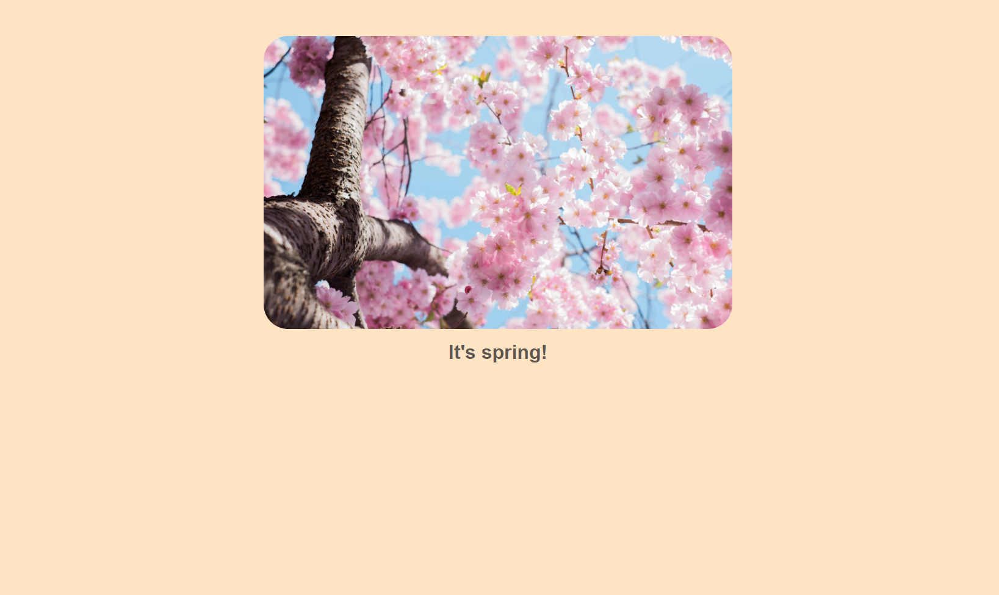

<h2>Seasons</h2>
 

 Frontend exercise developed during Senai's DEVinHouse course. Get the current date and shows on the screen an image and phrase for each season.

 
<ul>
<li>HTML</li>
<li>CSS</li>
<li>JS</li>
</ul>
 
 

 
 
